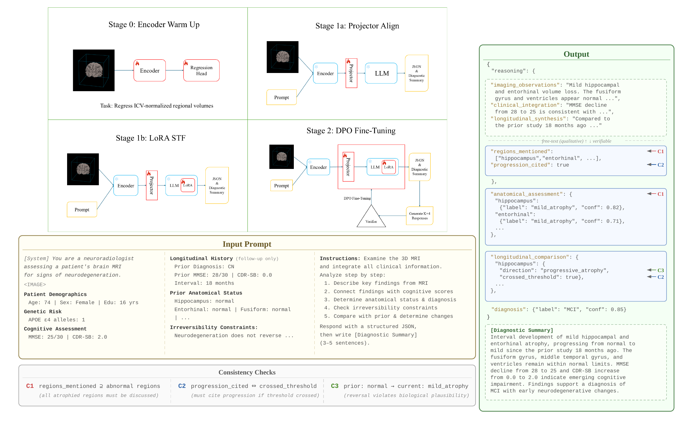

# LoV3D: Grounding Cognitive Prognosis Reasoning in Longitudinal 3D Brain MRI via Regional Volume Assessments

This paper has been submitted to **MICCAI 2026**. Model weights will be uploaded to Hugging Face upon acceptance.

---

## Before You Start: Data Preprocessing

**Strict data preprocessing is required before using this model.**

The most common mistake is downloading pre-processed MRI files directly from dataset portals. These files have gone through different preprocessing pipelines depending on who uploaded them — some are skull-stripped, some aren't; some are registered to MNI space, some to a different template; intensity normalization methods vary. This inconsistency will degrade training quality and produce unreliable results.

Instead, download the **raw MRI scans** (DICOM or unprocessed NIfTI) and run them through a standardized preprocessing pipeline. We provide ours in `src/data/preprocess_mri.py`, but any pipeline that performs the following steps should work:

1. **DICOM to NIfTI conversion** — Convert raw scanner output to NIfTI format (`dcm2niix`).
2. **RAS+ reorientation** — Ensure all volumes share a consistent axis convention.
3. **N4 bias field correction** — Remove intensity inhomogeneity from RF coil non-uniformity (ANTsPy).
4. **Skull stripping** — Remove non-brain tissue. We use HD-BET; any reliable brain extraction tool is fine.
5. **Affine registration to MNI152** — Align to standard space. Must be affine-only — nonlinear registration would warp away the atrophy patterns the model needs to detect.
6. **Z-score intensity normalization** — Standardize intensities within the brain mask, clip to [-3, +3].
7. **Resize to 128^3** — Resample to 128x128x128 and save as `.npy` (`src/data/resize_data.py`).

Data sources:

| Dataset | Source | Access |
|---------|--------|--------|
| **ADNI** | [adni.loni.usc.edu](http://adni.loni.usc.edu/) | Requires application |
| **MIRIAD** | [miriad.drc.ion.ucl.ac.uk](https://www.ucl.ac.uk/brain-sciences/ion/research/research-centres/dementia-research-centre/research-clinical-trials/minimal-interval-resonance-imaging-alzheimers-disease-miriad) | Requires application |
| **AIBL** | [aibl.csiro.au](https://aibl.csiro.au/) | Requires application |

For ADNI, you will also need `ADNIMERGE.csv` (clinical metadata) and FreeSurfer cross-sectional results.

## Project Structure

```
lov3d/
├── src/
│   ├── model/
│   │   └── stage1_model.py              # The VLM: encoder + projector + LLM
│   ├── data/
│   │   ├── preprocess_mri.py            # 6-step MRI preprocessing pipeline
│   │   ├── resize_data.py               # Resize preprocessed NIfTI → 128^3 .npy
│   │   ├── build_stage1_data.py         # Build SFT training data JSONs
│   │   ├── build_singleturn_data.py     # Build SFT data (ablation variant)
│   │   ├── stage1_dataset.py            # PyTorch Dataset for SFT training
│   │   └── dpo_dataset.py              # DPO preference pair dataset
│   ├── train/
│   │   ├── train_stage0.py              # Stage 0: encoder warmup (volume regression)
│   │   ├── train_ablation.py            # Stage 1: projector alignment + LoRA SFT
│   │   ├── train_stage2.py              # Stage 2: Verifier-guided DPO
│   │   ├── eval_stage2.py               # Full evaluation (35+ metrics)
│   │   └── eval_miriad.py               # MIRIAD zero-shot evaluation
│   └── eval/
│       └── verifier.py                  # Clinically-weighted Verifier scorer
├── scripts/
│   ├── build_stage0_data.py             # Build encoder warmup data from ADNIMERGE
│   ├── gen_dpo_candidates.py            # Sample K=4 candidate responses for DPO
│   ├── gen_dpo_worker.py                # Multi-GPU parallel candidate generation
│   ├── score_dpo_candidates.py          # Score candidates → preference pairs
│   ├── rescore_dpo.py                   # Re-score with updated Verifier config
│   ├── merge_dpo_shards.py             # Merge parallel DPO generation outputs
│   ├── merge_dpo_chunks.py             # Merge DPO worker chunks
│   ├── eval_1b_full.py                  # Standalone Stage 1b evaluation
│   ├── eval_radfm.py                    # RadFM baseline evaluation
│   ├── eval_m3d.py                      # M3D-LaMed baseline evaluation
│   ├── threshold_sensitivity.py         # Normative threshold sensitivity analysis
│   ├── verifier_sensitivity.py          # Verifier weight sensitivity analysis
│   ├── build_miriad_csv.py              # MIRIAD metadata construction
│   ├── build_aibl_manifest.py           # AIBL data manifest
│   ├── build_aibl_test_json.py          # AIBL evaluation data
│   └── build_aibl_eval_metadata.py      # AIBL evaluation metadata
├── data_splits/
│   ├── normative_model.json             # Fitted normative Z-score coefficients
│   └── field_missing_rates.json         # Per-field missing rates in training data
├── assets/
│   └── architecture.png
├── requirements.txt
└── README.md
```

## Method


Note: All patient data shown in the figure above is entirely synthetic and does not correspond to any real individual. It is provided solely for illustrative purposes.

### Architecture

LoV-3D connects a 3D CNN encoder to a large language model through an MLP projector. The encoder is a MONAI ResNet-50 (pretrained with Med3D) truncated after `layer3`. We chose a CNN over vision transformers because the encoder warmup stage only has about a thousand scans — too few for data-hungry architectures like ViT or Swin to train properly.

The encoder takes a 128^3 MRI volume and produces a feature map, which is pooled down and reshaped into 512 visual tokens. Each token is projected to match the LLM's embedding dimension via a two-layer MLP with GELU activation. These visual tokens are concatenated with the tokenized text prompt and fed into Qwen-2.5-14B, fine-tuned with LoRA.

The text prompt includes patient demographics, APOE genotype, cognitive test scores, and for follow-up visits, the prior scan's anatomical labels from FreeSurfer. The **current** scan's FreeSurfer measurements are never shown to the model — they are used only as ground truth for the Verifier.

### Verifiable Structured Output

Instead of generating free text, the model produces a JSON object with both qualitative fields (free-text reasoning) and verifiable fields (categorical labels). The JSON is designed with a reasoning-first ordering: the model writes its observations and clinical reasoning before committing to categorical predictions, the same way a clinician thinks before diagnosing.

This structure makes three types of errors detectable by code:
- **Reasoning-label consistency**: if the model labels a region as abnormal but doesn't mention it in its reasoning, that's a detectable inconsistency.
- **Longitudinal coherence**: change directions and threshold crossings must be mutually consistent.
- **Biological plausibility**: neurodegeneration doesn't reverse. If a region jumps from severe atrophy to normal between visits, something is wrong.

After the JSON, the model generates a diagnostic summary paragraph.

### Normative Z-Score Model

Ground-truth anatomical labels come from FreeSurfer volumes converted to severity categories through a normative model. The model is fitted exclusively on cognitively normal training subjects, regressing ICV-normalized volumes against age and sex. The residual Z-scores are discretized into normal, mild, and severe levels. Soft tolerance zones around the boundaries handle FreeSurfer's inherent segmentation noise — within these zones, adjacent labels get partial credit rather than being counted as hard errors.

### Clinically-Weighted Verifier

The Verifier scores model outputs against the FreeSurfer-derived ground truth across five components: anatomical accuracy, diagnostic accuracy, longitudinal change detection, reasoning consistency, and summary-JSON alignment. Diagnostically important regions (hippocampus, entorhinal cortex) are weighted higher. A global multiplier heavily penalizes catastrophic misdiagnosis — calling Dementia as CN gets a much harsher penalty than confusing CN with MCI.

### Verifier-Guided Preference Optimization (DPO)

The Verifier enables preference optimization without human labels. For each training sample, we generate four candidate responses with temperature sampling, score them all with the Verifier, and use the best and worst as the chosen-rejected pair for DPO. When even the best candidate is poor, the ground-truth response substitutes in. The training loss combines DPO with supervised fine-tuning on ground truth.

This is where the structured output really pays off. With free text, you'd need something like ROUGE to compare responses, but ROUGE can't tell the difference between "mild hippocampal atrophy" and "no hippocampal atrophy" — they share most tokens. Structured verification is deterministic and directly reflects clinical accuracy.

### Training Pipeline

Training has three stages, each building on the previous:

- **Stage 0 (Encoder Warmup)**: Train the ResNet-50 encoder to predict FreeSurfer volumes from MRI via multi-task regression. This teaches the encoder anatomy-relevant features. After this, the encoder is frozen.
- **Stage 1a (Projector Alignment)**: Train only the MLP projector (encoder and LLM frozen) to map visual tokens into the LLM's embedding space.
- **Stage 1b (LoRA SFT)**: Train the projector and LoRA adapters jointly. The LLM learns to produce structured clinical outputs.
- **Stage 2 (Verifier-Guided DPO)**: Merge Stage 1b LoRA, apply a fresh adapter, and run Verifier-guided DPO. This is the stage that brings the biggest improvement in report quality and reduces false alarms.


## Requirements

```
torch>=2.0
monai>=1.4
transformers>=4.48
peft>=0.14
nibabel
scipy
pandas
scikit-learn
```

See `requirements.txt` for full list.


